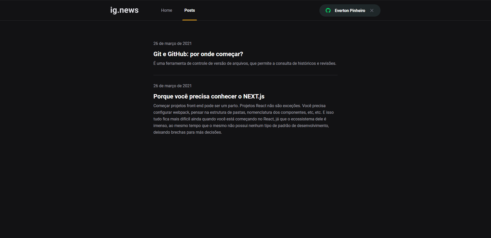
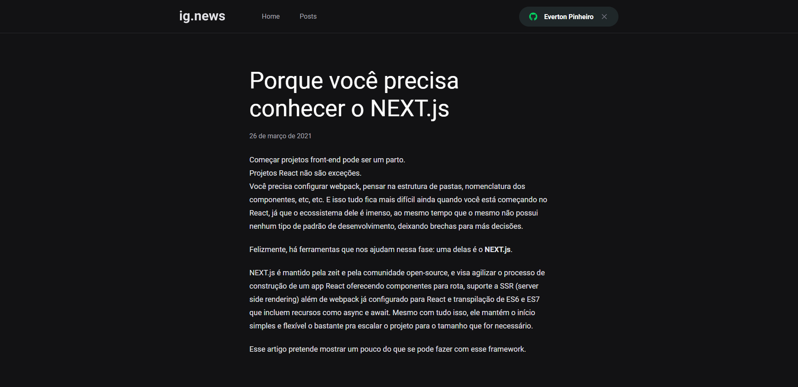

<h1 align="center">
  
</h1>
<h1 align="center">
  Chapter 03
</h1>
<p align="center">
  <a href="#-project">Project</a>&nbsp;&nbsp;&nbsp;|&nbsp;&nbsp;&nbsp;
  <a href="#-technologies">Technologies</a>&nbsp;&nbsp;&nbsp;|&nbsp;&nbsp;&nbsp;
    <a href="#-preview">Preview</a>&nbsp;&nbsp;&nbsp;|&nbsp;&nbsp;&nbsp;
  <a href="#-getting-started">Getting started</a>&nbsp;&nbsp;&nbsp;
</p>

<p align="center">
  <a href="https://www.linkedin.com/in/evertonpinheiroti/"></a>
  </a>
  
  <a href="https://github.com/TIEverton/ignews/stargazers">
    
  </a>
</p>

## 💻 Project

Chapter three consisted of creating an application to share paid content, where integration with Stripe, FaunaDB and Prismic for content management was carried out.



## ✨ Technologies

This project was developed using the following technologies:

- [React](https://reactjs.org)
- [NextJS](https://nextjs.org/)
- [TypeScript](https://www.typescriptlang.org/)
- [FaunaDB](https://fauna.com/)
- [Stripe](https://stripe.com/)
- [Prismic](https://prismic.io/)

## 🔥 Preview

In progress...

## 🚀 Getting started

Clone the project and access the folder

```bash
$ git clone https://github.com/TIEverton/ignews.git && cd ignews
```

Follow the steps below

```bash
# Install the dependencies
$ yarn

# Start the project
$ yarn dev
```
You can now access [`localhost:3000`](http://localhost:3000) from your browser.

---

Done with ♥ by Everton Pinheiro 👋🏻
